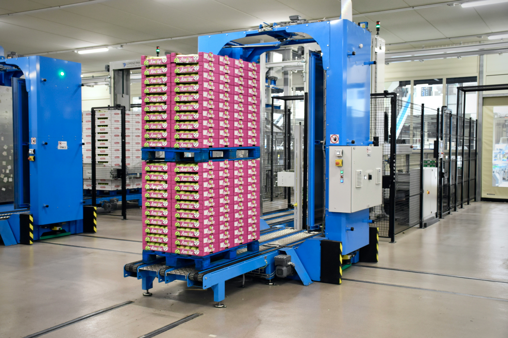

export const article = {
  date: '2024-07-02',
  title:
    'Revolutionizing Inventory Management: The Power of AI-Driven Planning',
  description:
    'Explore how AI-driven inventory planning is transforming supply chain management, offering unprecedented accuracy and efficiency in an increasingly complex market.',
  author: {
    name: 'Ridhwaan Mayet',
    role: 'Data Scientist',
  },
}

export const metadata = {
  title: article.title,
  description: article.description,
}

## Introduction

In today's rapidly evolving business landscape, effective inventory management has become more critical—and more challenging—than ever before. As product varieties multiply and customer expectations soar, traditional inventory planning methods are struggling to keep pace. Enter AI-driven inventory planning: a game-changing approach that's reshaping how businesses optimize their supply chains.

## The Evolution of Inventory Planning

Traditionally, inventory planning relied on static, rule-based systems within Material Requirements Planning (MRP) frameworks. While these systems served their purpose for decades, they fall short in today's dynamic market conditions. They lack the ability to:

1. Adapt in real-time to new information
2. Account for real-world uncertainties in supply and demand
3. Continuously learn and optimize from data
4. Extract meaningful insights from time series inventory data

<TopTip>
  The transition from static to dynamic inventory planning is not just an
  upgrade—it's a fundamental shift in how businesses approach supply chain
  management.
</TopTip>

## AI: The New Frontier in Inventory Optimization

AI-driven inventory planning leverages advanced machine learning models to analyze a multitude of variables:

- Demand fluctuations
- Supplier delivery times
- Quality issues
- Production disruptions
- Market trends

By continuously processing this data, AI systems can dynamically optimize reorder parameters, ensuring that inventory levels are always aligned with current market conditions.

## The Benefits of AI-Driven Inventory Planning

1. **Reduced Inventory Levels**: By accurately predicting demand and optimizing stock levels, businesses can significantly reduce excess inventory.

2. **Improved Service Levels**: AI helps ensure the right products are available at the right time, enhancing customer satisfaction.

3. **Increased Flexibility**: Rapid adaptation to market changes allows businesses to stay agile in volatile conditions.

4. **Cost Savings**: Lower inventory holding costs and reduced risk of write-downs contribute to a healthier bottom line.

5. **Enhanced Decision Making**: AI provides data-driven insights, empowering managers to make more informed decisions.

<TopTip>
  Implementing AI-driven inventory planning can lead to a 20-30% reduction in
  inventory costs while simultaneously improving service levels.
</TopTip>

## Overcoming Complexity in Modern Manufacturing

Today's manufacturing landscape is characterized by unprecedented complexity. Companies often offer products with hundreds of configurable options, resulting in thousands of potential permutations. This complexity poses a significant challenge for inventory management:

- Final configurations are often unknown until late in the order process
- Maintaining sufficient inventory for all possible configurations is costly
- Traditional methods struggle to balance stock levels with service requirements

AI-driven planning addresses these challenges by:

- Utilizing predictive analytics to anticipate likely configurations
- Dynamically adjusting inventory levels based on real-time demand signals
- Optimizing component stocks to support multiple product variants

## Implementing AI-Driven Inventory Planning: Key Considerations

1. **Data Quality**: Ensure your data collection and management processes are robust. AI models are only as good as the data they're trained on.

2. **Integration**: Seamlessly integrate AI systems with existing ERP and supply chain management tools.

3. **Change Management**: Prepare your team for the shift to a more data-driven, dynamic planning approach.

4. **Continuous Learning**: Implement feedback loops to allow your AI systems to learn and improve over time.

5. **Scalability**: Choose solutions that can grow with your business and adapt to changing market conditions.

## The Future of Inventory Planning

As AI technology continues to advance, we can expect even more sophisticated inventory planning capabilities:

- Real-time supply chain visibility and optimization
- Predictive maintenance to prevent stock-outs due to equipment failure
- Integration with IoT devices for granular inventory tracking
- Autonomous replenishment systems

## Conclusion

AI-driven inventory planning is not just a trend—it's a fundamental shift in how businesses approach supply chain management. By embracing this technology, companies can navigate the complexities of modern manufacturing, reduce costs, and meet customer expectations with unprecedented accuracy and efficiency.

As we move forward, the businesses that thrive will be those that leverage AI to turn their inventory from a cost center into a strategic asset. The future of inventory planning is here, and it's powered by artificial intelligence.
