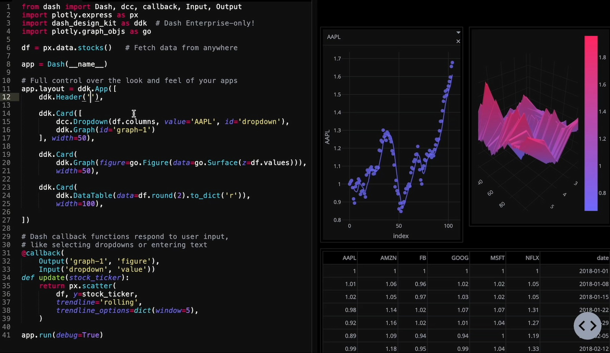

export const article = {
  date: '2024-07-04',
  title:
    'Unleashing the Power of Predictive Analytics: A Strategic Imperative for Modern Businesses',
  description:
    'Discover how predictive analytics is revolutionizing decision-making across industries and learn the key strategies for successful implementation.',
  author: {
    name: 'Ridhwaan Mayet',
    role: 'Data Scientist',
  },
}

export const metadata = {
  title: article.title,
  description: article.description,
}

## Introduction

In today's data-driven business landscape, predictive analytics has emerged as a powerful tool for organizations seeking to gain a competitive edge. By leveraging advanced mathematical and statistical methods, including artificial intelligence and machine learning, companies can now forecast future trends, anticipate customer behavior, and optimize operations with unprecedented accuracy.

## The Strategic Value of Predictive Analytics

Predictive analytics is not merely a technological advancement; it's a strategic imperative. By embedding AI-powered predictive models into core business processes, organizations can drive significant improvements across multiple dimensions:

1. **Cost Reduction**: Anticipate maintenance needs, optimize inventory levels, and streamline operations.
2. **Revenue Growth**: Identify upsell opportunities, predict customer churn, and tailor marketing strategies.
3. **Risk Mitigation**: Detect fraudulent activities, assess credit risks, and enhance cybersecurity measures.
4. **Operational Excellence**: Optimize supply chains, improve production scheduling, and enhance resource allocation.

<TopTip>
  To maximize the impact of predictive analytics, focus on use cases that align
  closely with your organization's strategic priorities and have clear,
  measurable outcomes.
</TopTip>

## Key Implementation Strategies

### 1. Data Integration and Quality Assurance

The foundation of effective predictive analytics lies in high-quality, integrated data. Organizations must:

- Establish robust data governance frameworks
- Implement data cleansing and normalization processes
- Develop a unified data architecture that breaks down silos

### 2. Advanced Modeling Techniques

Leverage state-of-the-art machine learning algorithms to build predictive models that can:

- Handle complex, non-linear relationships
- Incorporate both structured and unstructured data
- Adapt to changing conditions through continuous learning

### 3. Scalable Infrastructure

Invest in a flexible, cloud-based infrastructure that can:

- Scale compute resources dynamically based on demand
- Support real-time data processing and model scoring
- Ensure high availability and disaster recovery

<TopTip>
  Consider adopting a hybrid cloud approach to balance the need for scalability
  with data security and compliance requirements.
</TopTip>

### 4. Cross-Functional Collaboration

Success in predictive analytics requires close collaboration between:

- Data scientists and domain experts
- IT and business units
- Executive leadership and frontline employees

Establish cross-functional teams and governance structures to ensure alignment and drive adoption.

## Industry-Specific Applications

### Manufacturing

- Predictive maintenance to reduce downtime and extend asset life
- Demand forecasting for optimized production planning

### Financial Services

- Credit scoring and risk assessment
- Fraud detection and anti-money laundering

### Healthcare

- Patient risk stratification for personalized care
- Resource allocation and capacity planning

### Retail

- Personalized product recommendations
- Inventory optimization and supply chain management

## The Path Forward

As predictive analytics continues to evolve, organizations must stay ahead of the curve by:

1. Investing in talent development and upskilling programs
2. Fostering a data-driven culture across all levels of the organization
3. Continuously evaluating and adopting emerging technologies, such as explainable AI and automated machine learning

By embracing predictive analytics as a core capability, businesses can transform data into actionable insights, driving innovation and creating sustainable competitive advantage in an increasingly complex and dynamic marketplace.
